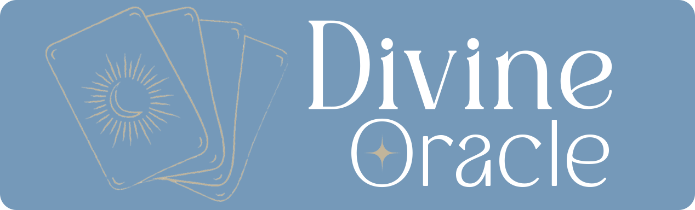
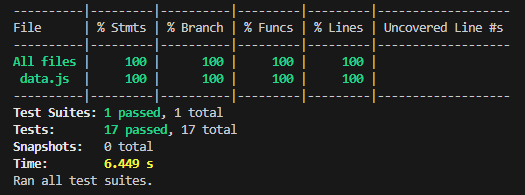

# Data Lovers

## Índice 

* [1. Prefácio](#1-prefácio)
* [2. Resumo do projeto](#2-resumo-do-projeto)
* [3. Sobre o tema e usuários](#3-sobre-o-tema-e-usuários)
* [4. Protótipos](#4-protótipos)
* [5. Testes de usabilidade](#5-testes-de-usabilidade)
* [6. Interface do projeto e objetivos alcançados](#6-interface-do-projeto-e-objetivos-alcançados)
* [7. Testes unitários](#7-testes-unitários)
* [8. Tecnologias utilizadas](#8-tecnologias-utilizadas)
* [9. Melhorias futuras](#9-melhorias-futuras)
* [Créditos](#créditos)
* [Autores](#autores)

***

***

## 1. Prefácio

O projeto em questão é uma aplicação web criada como parte do bootcamp da Laboratoria, em que o seu principal objetivo é visualizar um conjunto de dados fornecidos que permite os usuários pesquisarem, filtrarem e ordenarem as informações de acordo com as suas necessidades. A ideia é visualizar os dados através de uma interface amigável e intuitiva. 
 
## 2. Resumo do projeto

Dentre os vários temas disponibilizados pela Laboratoria para realização do projeto, nós escolhemos o tema Tarot. O Divine Oracle dá acesso aos usuários à todas as cartas do deck - baralho - do tarot, mostrando as principais características e significados das cartas a fim de consulta. Com isso, os usuários podem pesquisar pelo nome da carta, filtrar pelo naipe, arcanos e ordenar pela numeração da carta (do maior para o menor e do menor para o maior) para facilitar a busca e compreensão.

## 3. Sobre o tema e usuários

Os principais usuários do Divine Oracle são tarotistas profissionais, aprendizes de tarot e pessoas interessadas em consultar os significados das cartas de tarot. Com isso, criamos as seguintes histórias dos usuários para desenvolver o projeto tendo como base as suas reais necessidades: 

### História usuário 1

<aside>
📎 Como tarotista eu quero buscar o significado das cartas para realizar as minhas consultas.
</aside>

 

**Critérios de aceitação** 

- Eu quero visualizar o significado das cartas com a face para cima e reverso;
- Eu quero poder consultar facilmente através de qualquer dispositivo.

### História usuário 2

<aside>
📎 Como aprendiz de tarot eu quero conhecer sobre todas as cartas para complementar os estudos.
</aside>

**Critérios de aceitação**

  - Eu quero poder visualizar todas as cartas de tarot;
  - Eu quero consultar uma carta pelo seu nome;
  - Eu quero consultar a descrição de cada carta.
  - Eu quero poder consultar facilmente através de qualquer dispositivo.

### História usuário 3

<aside>
📎 Como aprendiz de tarot eu quero saber quais cartas são do tipo arcano menor e arcano maior para entender melhor a sua influência.
</aside>

**Critérios de aceitação**

- Eu quero poder filtrar as cartas por tipo arcano menor e arcano maior;
- Eu quero poder consultar facilmente através de qualquer dispositivo.

### História usuário 4

<aside>
📎 Como tarotista, quero consultar as cartas por naipe para eu poder avaliar a relevância de cada grupo.
</aside>

**Critérios de aceitação**

- Eu quero poder filtrar as cartas pelo seu naipe;
- Eu quero poder visualizar as informações sobre as cartas, como: significado, naipe e valor;
- Eu quero poder consultar facilmente através de qualquer dispositivo.

### História usuário 5

<aside>
📎 Como tarotista eu quero pesquisar a carta pelo seu nome para encontrar uma carta específica.
</aside>

**Critérios de aceitação**

- Eu quero um campo para pesquisar uma carta pelo seu nome;
- Eu quero visualizar o significado das cartas com a face para cima e reverso;
- Se a carta não aparecer quero ser informado sobre isso (deve aparecer: carta não encontrada)
- Eu quero poder consultar facilmente através de qualquer dispositivo.

### **Definição de pronto**

- O código tem, e passa, pelos testes unitários e cobrem um mínimo de 70% de statements, functions, lines e branches;
- O código está no repositório;
- O projeto deverá ser implantado no GitHub pages;
- O projeto foi testado com pelo menos 5 usuários e foram realizadas as melhorias necessárias identificadas no teste de usabilidade;
- UI: É responsivo.

## 4. Protótipos

O protótipo foi desenvolvido levando em consideração as necessidades dos usuários, para que eles pudessem encontrar as informações sobre as cartas de forma intuitiva e fácil.  Pensando na praticidade, escolhemos dispor todas as cartas com parte das informações no verso da carta e as demais informações no modal que pode ser acessada através do botão _learn more_.

### Protótipo de baixa fidelidade

### Protótipo de alta fidelidade

**Desktop**

**Mobile**

 

## 5. **Testes de usabilidade**

Os testes de usabilidade foram realizados em média com 5 pessoas, para entendermos se a interface criada no protótipo estava intuitiva e de fácil compreensão para os usuários.  Com isso, percebemos que algumas pessoas tiveram dificuldade para identificar como seria feita a ordenação e qual seria o objetivo geral do site. 

Sendo assim, implementamos as alterações na ordenação, indicando que seria uma ordenação numérica e adicionamos uma tela de boas-vindas para contextualizar o usuário. 

## 6. **Interface do projeto e objetivos alcançados**

Para que pudéssemos ter um bom aproveitamento dos dados a serem manipulados seguimos da seguinte forma:

- Criamos as histórias dos usuários para compreender o que seria buscado;
- Fizemos o protótipo de baixa fidelidade para testarmos as primeiras ideias de forma rápida, enquanto o protótipo de alta fidelidade foi criado para simular uma experiência mais realista;
- Realizamos os testes de usabilidade para avaliar como os usuários interagem com o produto identificando possíveis problemas de uso e melhorias.
- O desenvolvimento foi realizado baseado nas etapas anteriores, levando em consideração os feedbacks e fazendo adaptações conforme a necessidade.

### **Os objetivos gerais alcançados no projeto:**

[✔] Mostrar os dados em uma interface: pode ser em cards, tabelas, listas, etc.

[✔] Permitir ao usuário interagir com a interface para obter as informações que necessita;

[✔] Ser *responsiva*, ou seja, deve ser visualizada sem problemas a partir de diversos tamanhos de tela: celulares, tablets, notebooks, etc.

[✔] Que a interface siga os fundamentos de *visual design*;

[✔] Testes unitários cobrirem um mínimo de 70% de statements, functions, lines e branches.

## 7. Testes unitários

Foram realizados testes unitários havendo uma cobertura de 100%.

 

## 8. **Tecnologias utilizadas**

- GitHub
- Git Bash
- Visual Studio Code
- HTML
- JavaScript
- CSS

## 9. **Melhorias futuras**

- Consumir dados estáticos de forma dinâmica, carregando um arquivo JSON com `fetch`;
- Adicionar à interface visualização de dados em forma de gráficos;
- Adicionar responsividade para mais telas;
- Adicionar uma tela para que o usuário possa tirar uma carta.

## **Créditos**

**Imagens:**

Background - <a href="https://br.freepik.com/fotos-gratis/imagem-de-papel-de-parede-de-fundo-abstrato-de-azul-de-aco_15601163.htm#from_view=detail_alsolike">Freepik </a>

Favicon - <a href="https://www.flaticon.com/br/icone-gratis/bola-de-cristal_4330587">Flaticon</a>

Deck Tarot - <a href="https://onyourjourney.co.uk/free-printable-tarot-cards-deck-with-all-78-cards/">On Your Journey</a>

Outras Imagens - <a href="https://www.canva.com/">Canva</a>

**Ícones:** 

GitHub - <a href="https://fontawesome.com/icons/github?f=brands&s=solid ">Font awesome</a>   

Expanded arrow - <a href="https://fontawesome.com/icons/chevron-down?f=classic&s=solid">Font awesome</a>  

Menu list - <a href="https://fontawesome.com/icons/bars?f=classic&s=solid">Font awesome</a> 

**Fontes:**

Open Sans - <a href="https://fonts.google.com/specimen/Open+Sans?query=open+sans">Google Fonts</a>

Milky Walky - <a href="https://www.dafont.com/pt/milky-walky.font">Da font</a>

Bizantheum - <a href="https://www.dafont.com/pt/bizantheum.font">Da font</a>

## **Autores**

- **Ana Ferreira** - <a href="https://github.com/anabfer"> @anabfer</a>

- **Erika Peloggia** - <a href="https://github.com/erikapeloggia"> @erikapeloggia</a>

- **Iana Rodrigues** - <a href="https://github.com/ianarodrigues"> @ianarodrigues</a>